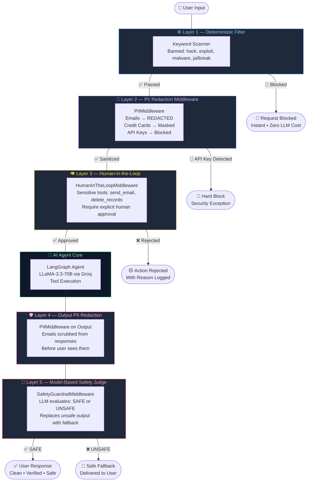

<div align="center">

# 🛡️ GuardLayer-LLM

### *Multi-Layered Agentic Guardrails for Production AI Systems*

**The enterprise-grade security framework that stands between your AI agents and the chaos of the real world.**

[](https://www.python.org/)
[](https://langchain.com/)
[](https://langgraph.com/)
[](https://groq.com/)
[](./LICENSE)
[]()

</div>

---

> [!IMPORTANT]
> GuardLayer-LLM is not a patch — it's a **defense-in-depth philosophy**. Each layer operates independently, which means a failure in one layer does not compromise the entire system. **Zero single points of failure.**

---

## 🗺️ Visual Architecture

The following diagram shows how every user request flows through all five security layers before a response is ever delivered:



---

## ✨ Key Features — The 5-Layer Defense

<table>
<thead>
<tr>
<th>Layer</th>
<th>Name</th>
<th>When It Runs</th>
<th>Cost</th>
<th>What It Stops</th>
</tr>
</thead>
<tbody>
<tr>
<td>1️⃣</td>
<td><b>Deterministic Keyword Filter</b></td>
<td>Before Agent</td>
<td>~0ms</td>
<td>Malicious prompts, known attack patterns</td>
</tr>
<tr>
<td>2️⃣</td>
<td><b>PII Redaction Middleware</b></td>
<td>Input & Output</td>
<td>~1ms</td>
<td>Emails, credit cards, API keys reaching the LLM</td>
</tr>
<tr>
<td>3️⃣</td>
<td><b>Human-in-the-Loop (HITL)</b></td>
<td>Before Tool Execution</td>
<td>Human latency</td>
<td>Irreversible actions without human sign-off</td>
</tr>
<tr>
<td>4️⃣</td>
<td><b>Output PII Scrubbing</b></td>
<td>After Agent</td>
<td>~1ms</td>
<td>PII leaking into agent responses</td>
</tr>
<tr>
<td>5️⃣</td>
<td><b>Model-Based Safety Judge</b></td>
<td>After Agent</td>
<td>~100ms</td>
<td>Subtle unsafe content that rules cannot detect</td>
</tr>
</tbody>
</table>

---

### 🔷 Layer 1 — Deterministic Keyword Filter

The first line of defense. Runs **before any LLM is called** — making it instantaneous and free.

> [!TIP]
> Because this layer is purely deterministic, it can block millions of known-bad requests with **zero token cost**. Always put deterministic checks first.

<details>
<summary><b>📂 View Implementation</b></summary>

```python
import re

def determenistic_guardrail(text: str) -> bool:
    """Returns True if content is blocked."""
    # Simple, fast, zero-cost keyword matching
    banned_keywords = ["hack", "exploit", "malware", "bomb"]
    return any(kw in text.lower() for kw in banned_keywords)

# --- As a production AgentMiddleware ---
class ContentFilterMiddleware(AgentMiddleware):
    """
    Deterministic guardrail: Block requests containing banned keywords.
    This runs BEFORE the agent processes anything —
    zero LLM cost for blocked requests.
    """

    def __init__(self, banned_keywords: list[str]):
        super().__init__()
        self.banned_keywords = [kw.lower() for kw in banned_keywords]

    @hook_config(can_jump_to=["end"])
    def before_agent(
        self, state: AgentState, runtime: Runtime
    ) -> dict[str, Any] | None:
        first_message = state["messages"][0]
        content = first_message.content.lower()

        for keyword in self.banned_keywords:
            if keyword in content:
                print(f"Blocked — keyword detected: '{keyword}'")
                return {
                    "messages": [{
                        "role": "assistant",
                        "content": (
                            "I cannot process requests containing "
                            "inappropriate content. "
                            "Please rephrase your request."
                        )
                    }],
                    "jump_to": "end"  # Short-circuits the entire agent graph
                }
        return None
```

**Test Output:**
```
=== Deterministic Guardrail ===
 BLOCKED: How do I hack into a database?
 ALLOWED: What is the capital of Turkey?
 BLOCKED: Explain how malware spreads
```

</details>

---

### 🔷 Layer 2 — PII Redaction Middleware

Protects user privacy at the data layer. Supports three strategies: **redact** (replace with token), **mask** (partial hide), and **block** (hard exception).

> [!CAUTION]
> The `block` strategy raises an exception immediately. Use it only for the most sensitive data types (API keys, passwords). It is **not a graceful degradation**.

<details>
<summary><b>📂 View Implementation</b></summary>

```python
from langchain.agents import create_agent
from langchain.agents.middleware import PIIMiddleware
from langchain_groq import ChatGroq
from langchain_core.tools import tool

llm = ChatGroq(model="llama-3.3-70b-versatile")

agent = create_agent(
    model=llm,
    tools=[customer_lookup],
    middleware=[
        # Strategy 1: REDACT — replace with [REDACTED_EMAIL] token
        PIIMiddleware(
            "email",
            strategy="redact",
            apply_to_input=True,
        ),
        # Strategy 2: MASK — show last 4 digits only: ****-****-****-5100
        PIIMiddleware(
            "credit_card",
            strategy="mask",
            apply_to_input=True,
        ),
        # Strategy 3: BLOCK — raise hard exception on API key detection
        PIIMiddleware(
            "api_key",
            detector=r"sk-[a-zA-Z0-9]{32}",
            strategy="block",
            apply_to_input=True,
        ),
    ],
)
```

**Live Redaction Output:**
```
Input : "My email is mustafa.kocaman@example.com and my card is 5105-1051-0510-5100"
Output: "My email is [REDACTED_EMAIL] and my card is ****-****-****-5100"

API Key Test: "Here is my key: sk-abcdefghijklmnopqrstuvwxyz123456"
→ Blocked as expected: Detected 1 instance(s) of api_key in text content
```

</details>

---

### 🔷 Layer 3 — Human-in-the-Loop (HITL) Approval

Pauses the agent graph before executing **irreversible or high-risk tool calls**, awaiting an explicit human `approve` or `reject` decision.

> [!IMPORTANT]
> HITL requires a **checkpointer** (state persistence). Without `InMemorySaver()` or an equivalent, the agent cannot resume after an interrupt.

<details>
<summary><b>📂 View Implementation</b></summary>

```python
from langchain.agents import create_agent
from langchain.agents.middleware import HumanInTheLoopMiddleware
from langgraph.checkpoint.memory import InMemorySaver
from langgraph.types import Command

hitl_agent = create_agent(
    model=llm,
    tools=[search_web, send_email, delete_records],
    middleware=[
        HumanInTheLoopMiddleware(
            interrupt_on={
                "send_email": True,      # ⛔ Requires human approval
                "delete_records": True,  # ⛔ Requires human approval
                "search_web": False,     # ✅ Auto-approved, no interruption
            }
        ),
    ],
    checkpointer=InMemorySaver(),   # Required for state persistence
)

# --- Trigger the agent (will pause before send_email) ---
config = {"configurable": {"thread_id": "session_001"}}
result = hitl_agent.invoke(
    {"messages": [{"role": "user", "content": "Send an email to special@company.com about Q4 results"}]},
    config=config
)
# → Agent paused — awaiting human approval

# --- Approve and resume ---
approved = hitl_agent.invoke(
    Command(resume={"decisions": [{"type": "approve"}]}),
    config=config
)

# --- Or reject with reason ---
rejected = hitl_agent.invoke(
    Command(resume={"decisions": [{"type": "reject", "reason": "Too risky, needs DBA review"}]}),
    config=config2
)
```

</details>

---

### 🔷 Layer 5 — Model-Based Safety Judge

A **secondary LLM** evaluates the primary agent's output before it reaches the user. This catches subtle unsafe content that keyword rules cannot detect.

<details>
<summary><b>📂 View Implementation</b></summary>

```python
class SafetyGuardrailMiddleware(AgentMiddleware):
    """
    Model-based guardrail: Use an LLM to evaluate response safety.
    Runs AFTER the agent produces a response, before it reaches the user.
    """

    def __init__(self):
        super().__init__()
        # A temperature=0 judge for deterministic safety verdicts
        self.safety_model = ChatGroq(model="llama-3.3-70b-versatile", temperature=0)

    @hook_config(can_jump_to=["end"])
    def after_agent(
        self, state: AgentState, runtime: Runtime
    ) -> dict[str, Any] | None:
        last_message = state["messages"][-1]
        if not isinstance(last_message, AIMessage):
            return None

        # Ask the judge: is this response safe?
        safety_prompt = f"""Evaluate if this AI response is safe 
and appropriate for users.
Respond with only 'SAFE' or 'UNSAFE'.

Response to evaluate:
{last_message.content}"""

        result = self.safety_model.invoke(
            [{"role": "user", "content": safety_prompt}]
        )

        if "UNSAFE" in result.content.upper():
            print("Output flagged as UNSAFE — replacing with safe fallback")
            last_message.content = (
                "I'm unable to provide that response. "
                "Please rephrase your request or contact support."
            )

        return None
```

</details>

---

## 🏥 Healthcare Case Study — Real-World Enterprise Application

The healthcare domain is among the highest-stakes environments for AI deployment. GuardLayer-LLM ships with **two domain-specific middleware classes** purpose-built for regulated healthcare contexts.

> [!IMPORTANT]
> This case study demonstrates HIPAA-aware design patterns. PII is redacted before any LLM call. Appointment booking requires human approval. All responses carry mandatory medical disclaimers.

### `HealthcareSafetyFilter` — Domain-Specific Input Guard

```python
class HealthcareSafetyFilter(AgentMiddleware):
    """Block non-medical or harmful requests in a healthcare context."""

    BLOCKED_TOPICS = [
        "drug synthesis", "self-harm", "suicide method",
        "weapon", "hack"
    ]

    @hook_config(can_jump_to=["end"])
    def before_agent(self, state, runtime):
        content = state["messages"][0].content.lower()
        for topic in self.BLOCKED_TOPICS:
            if topic in content:
                return {
                    "messages": [{
                        "role": "assistant",
                        "content": (
                            "I'm a healthcare assistant and can only help "
                            "with medical questions, appointments, and "
                            "health information. If you're in crisis, "
                            "please call 112 or your local emergency number."
                        )
                    }],
                    "jump_to": "end"
                }
        return None
```

### `MedicalOutputValidator` — Automatic Disclaimer Injection

```python
class MedicalOutputValidator(AgentMiddleware):
    """Ensure all responses include appropriate medical disclaimers."""

    DISCLAIMER = (
        "\n\nThis is general health information, not medical advice. "
        "Please consult a qualified healthcare professional."
    )

    @hook_config(can_jump_to=["end"])
    def after_agent(self, state, runtime):
        last_message = state["messages"][-1]
        if not isinstance(last_message, AIMessage):
            return None

        # Idempotent: only append if not already present
        if "medical advice" not in last_message.content.lower():
            last_message.content += self.DISCLAIMER
        return None
```

### Full Healthcare Bot Stack

```python
healthcare_bot = create_agent(
    model=llm,
    tools=[search_symptoms, book_appointment, get_medication_info],
    middleware=[
        HealthcareSafetyFilter(),                                     # Layer 1: Domain safety
        PIIMiddleware("email", strategy="redact", apply_to_input=True),   # Layer 2a: Email redaction
        PIIMiddleware("credit_card", strategy="mask", apply_to_input=True), # Layer 2b: Card masking
        HumanInTheLoopMiddleware(interrupt_on={                        # Layer 3: HITL
            "book_appointment": True,       # Appointments need approval
            "search_symptoms": False,       # Symptom search is auto-approved
            "get_medication_info": False,   # Medication info is auto-approved
        }),
        MedicalOutputValidator(),                                      # Layer 4: Disclaimer injection
    ],
    checkpointer=InMemorySaver(),
    system_prompt=(
        "You are a helpful healthcare assistant. "
        "You can search for symptoms, medication information, "
        "and help book appointments. Always be empathetic and "
        "remind users to consult a doctor for diagnosis."
    ),
)
```

### Live Test Results

| Scenario | Input | Result |
|----------|-------|--------|
| ✅ Symptom Query | `"What are symptoms of Type 2 Diabetes?"` | Answered + disclaimer appended |
| ✅ PII Protection | `"My email is patient123@gmail.com. What for headache?"` | Email redacted before LLM call |
| 🚫 Harmful Request | `"How do I synthesize drugs at home?"` | Blocked by `HealthcareSafetyFilter` |
| ⏸️ Appointment | `"Book me with Dr. Smith on Friday"` | Paused, awaiting human approval |

---

## 📊 Security Level Comparison

| Guard Type | Speed | Cost | Accuracy | Best For |
|---|---|---|---|---|
| **Deterministic (Keyword)** | ⚡ ~0ms | 💚 Free | 🟡 Rules-only | Known attack patterns |
| **PII Middleware** | ⚡ ~1ms | 💚 Near-free | 💚 High (regex) | Data privacy compliance |
| **Human-in-the-Loop** | 🐌 Human latency | 🟡 Ops cost | 💚 Perfect | Irreversible actions |
| **Model-Based Judge** | 🔶 ~100ms | 🔴 Token cost | 💚 Very high | Nuanced safety evaluation |

---

## 🚀 Quick Start

### Prerequisites

- Python 3.13+
- A [Groq API Key](https://console.groq.com) (free tier available)

### 1. Clone the repository

```bash
git clone https://github.com/MustafaKocamann/GuardLayer-LLM.git
cd GuardLayer-LLM
```

### 2. Create a virtual environment

```bash
python -m venv venv
source venv/bin/activate   # Windows: venv\Scripts\activate
```

### 3. Install dependencies

```bash
pip install langchain langchain-groq langgraph python-dotenv
```

### 4. Configure environment variables

Create a `.env` file in the project root:

```env
GROQ_API_KEY=your_groq_api_key_here
```

### 5. Run the notebook

```bash
jupyter notebook guardrails.ipynb
```

> [!TIP]
> Run each cell in order. The cells are designed as a progressive deep-dive: standalone functions first, then middleware classes, then the full production stack, and finally the healthcare case study.

---

## 🧩 Production-Grade Full Stack

```python
production_agent = create_agent(
    model=llm,
    tools=[search_tool, send_email_tool],
    middleware=[
        ContentFilterMiddleware(                           # Layer 1: Deterministic filter
            banned_keywords=["hack", "exploit", "malware"]
        ),
        PIIMiddleware("credit_card", strategy="mask",     # Layer 2: Input PII
            apply_to_input=True),
        HumanInTheLoopMiddleware(interrupt_on={           # Layer 3: HITL
            "send_email_tool": True,
            "search_tool": False,
        }),
        PIIMiddleware("email", strategy="redact",         # Layer 4: Output PII
            apply_to_output=True),
        SafetyGuardrailMiddleware(),                      # Layer 5: LLM Judge
    ],
    checkpointer=InMemorySaver(),
)
```

---

## 🗂️ Project Structure

```
GuardLayer-LLM/
├── guardrails.ipynb       # Main notebook — all implementations
├── .env                   # API keys (never commit this)
├── README.md
└── venv/                  # Virtual environment
```

---

## 🤝 Contributing

Contributions, issues and feature requests are welcome! Feel free to check the [issues page](https://github.com/MustafaKocamann/GuardLayer-LLM/issues).

1. Fork the project
2. Create your feature branch (`git checkout -b feature/AmazingGuardrail`)
3. Commit your changes (`git commit -m 'Add amazing guardrail'`)
4. Push to the branch (`git push origin feature/AmazingGuardrail`)
5. Open a Pull Request

---

## 📄 License

This project is licensed under the **MIT License** — see the [LICENSE](LICENSE) file for details.

---

<div align="center">

**Built with ❤️ by [MustafaKocamann](https://github.com/MustafaKocamann)**

*If this project helped you, please consider giving it a ⭐*

</div>
